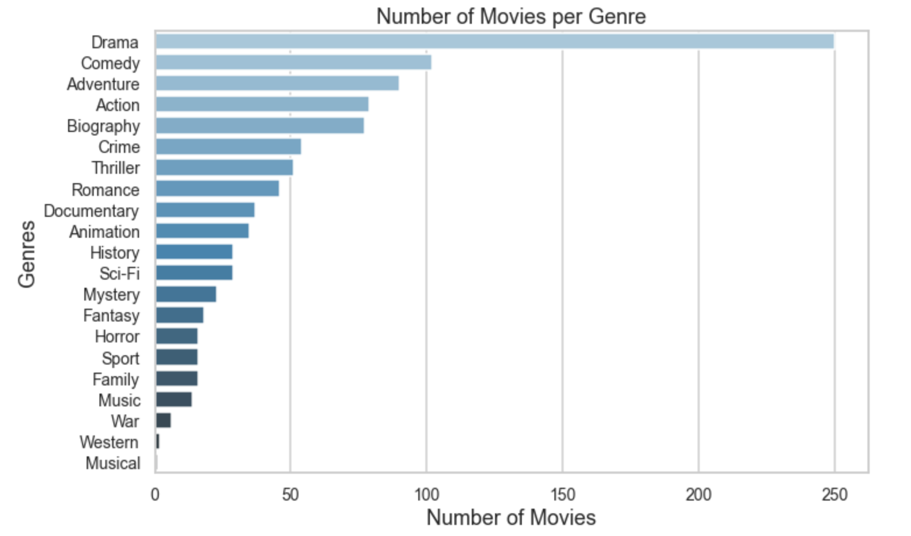
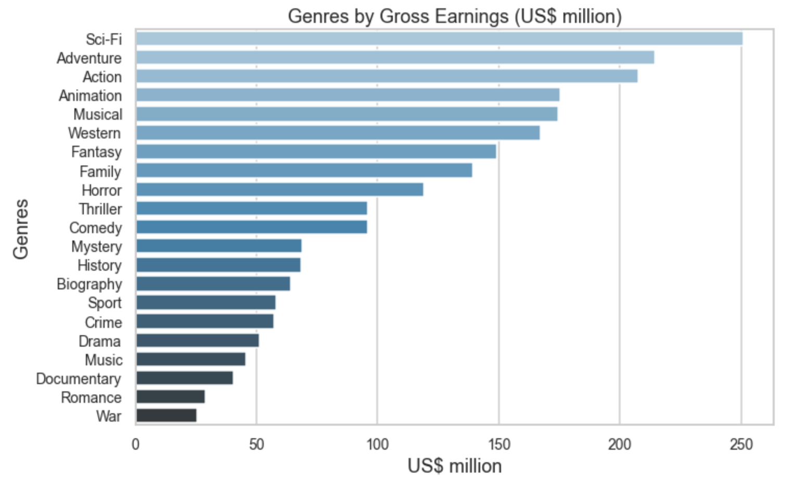

# Microsoft's Movie Studio Vision: A Needs Analysis

**Authors**: Rebecca Frost-Brewer

## Overview

This project analyzes current trends in the movie industry to establish a vision for Microsoft's new movie studio, Microsoft Tenné. Descriptive analysis of data from IMDb, The Movie Database, and Box Office Mojo provides insight into the genre of films that have the highest audience ratings and highest gross earnings. Microsoft Tenné can use this analysis to guide their decision-making process in determining what genre of movie to produce.


## Business Problem

Microsoft sees many big companies creating original video content and want to establish their own movie studio to compete within the digital content market. 

To assist Microsoft in solving this problem, I will consider:

* What genres are the most successful, both in terms of audience rating and gross earnings?
* Of the top grossing films, which genres were most successful (had the highest gross earnings)?
* Is there a correlation between audience rating and gross earnings?


## Data Understanding

The data for this analysis have come from:

* The Movie Database (movie title, audience rating)
* IMDb (movie title, release year, genres, and audience rating)
* Box Office Mojo (movie title, gross earnings)

The target variables for this analysis are release year, gross earnings, genres, and audience ratings. These variables are all important and necessary to address Microsoft's business problem. Audience ratings, gross earnings, and release year are numeric variables (though gross earnings is continuous) and genres are categorical. 

The data used in this analysis has been compiled from three different platforms and includes all movies these platforms monitor. Since we are providing Microsoft with recommendations for success, we can safely assume these platforms accurately account for the movies of interest.

As we consider this data however, we should note that the data includes movies from 2010 to 2018. This is noteworthy because the data does not include the most recent three years of movie-making; since movie-watching trends can shift dramatically year to year, the conclusions and recommendations presented here may change based on more recent movies.


## Data Preparation

To prepare the data for analysis, I needed to combine four individual csv files into one master file. Luckily, since we're dealing with movies and movie titles, I was able to use the titles as the key for joining the dataframes.

For the IMDb files, I did drop the 'original_title', 'runtime_minutes', and 'numvotes' columns as they are not relevant or pertinent to the business questions I am addressing.

For each of the files, I also dropped all rows that had any NaN values. I made this decision because I determined that if a movie was missing any data from these sources, that movie would not be mainstream popular nor would have gross earnings of significance. For the purposes of this analysis, I decided to focus on any movies with an average audience rating 7.0 or greater and with gross earnings greater than $3mil. Movies with NaN values would not meet those conditions, therefore could be dropped without worrying about significantly altering the analysis.

Futher, both IMDb and The Movie Database had a measure of average rating - I created a new variable that took the average of these averages, for one "master" average rating that was used in analysis. That way, the ratings from both sources were incorporated.

Lastly, I modified the gross earnings number by dividing the value by 1mil. Since the gross earnings for the movies I was analyzing are obviously more than just 1mil, I wanted the value to be more readable.

To finalize the data preparation, I created a smaller dataframe of just those movies with an average rating of 7.0 or greater and gross earnings of at least $3mil. For movies with multiple genres, I split each genre individually.


## Results

Present your key results. For Phase 1, this will be findings from your descriptive analysis.

***
Questions to consider:
* How do you interpret the results?
* How confident are you that your results would generalize beyond the data you have?
***

Here is an example of how to embed images from your sub-folder:

### Number of Movies per Genre


### Genres by Gross Earnings (US$ million)


### Gross Earnings by Genre Per Year: 2013-2018


## Conclusions

Provide your conclusions about the work you've done, including any limitations or next steps.

***
Questions to consider:
* What would you recommend the business do as a result of this work?
* What are some reasons why your analysis might not fully solve the business problem?
* What else could you do in the future to improve this project?
***

## For More Information

Please review our full analysis in [our Jupyter Notebook](./dsc-phase1-project-template.ipynb) or our [presentation](./DS_Project_Presentation.pdf).

For any additional questions, please contact **name & email, name & email**

## Repository Structure

Describe the structure of your repository and its contents, for example:

```
├── __init__.py                         <- .py file that signals to python these folders contain packages
├── README.md                           <- The top-level README for reviewers of this project
├── dsc-phase1-project-template.ipynb   <- Narrative documentation of analysis in Jupyter notebook
├── DS_Project_Presentation.pdf         <- PDF version of project presentation
├── code
│   ├── __init__.py                     <- .py file that signals to python these folders contain packages
│   ├── visualizations.py               <- .py script to create finalized versions of visuals for project
│   ├── data_preparation.py             <- .py script used to pre-process and clean data
│   └── eda_notebook.ipynb              <- Notebook containing data exploration
├── data                                <- Both sourced externally and generated from code
└── images                              <- Both sourced externally and generated from code
```
